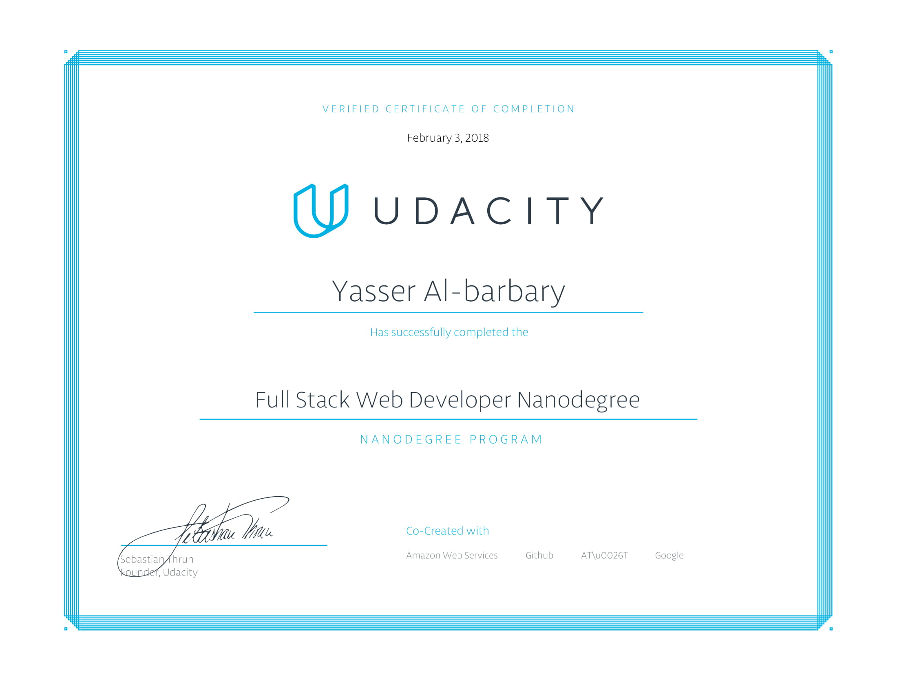

### About# Full Stack Web Developer Nanodegree

This repository contains project work for Udacity's [Full Stack Web Developer Nanodegree] 

### Projects
- **p1** - Movie Trailer Website
- **p2** - Tournament Results
- **p3** - Item Catalog
- **p4** - Conference Organization App
- **p5** - Portfolio Website
- **p6** - Linux Server Configuration
- **p7** - MultiUserBlog
- **p8** - NeighborhoodMap

### Courses
- Programming Foundations with Python
- Intro to Relational Databases
- Full Stack Foundations
- Developing Scalable Apps with Python
- Linux Basics for Web Developers
